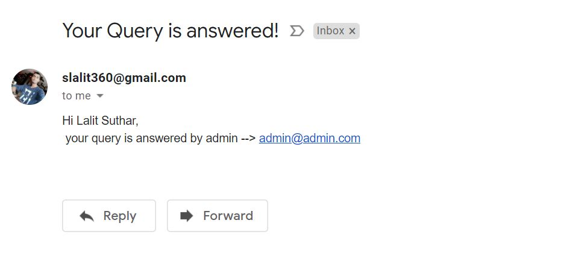

**Assignment info**

Use case: Visualize an application that is used by students and mentors where in the students can post questions to mentors and get their answers.
The task is to Implement API endpoints to post questions to Mentor. As a part of this code assessment, the following APIs are to be implemented to enable the corresponding actions
1. Register User
2. User Login
3. Send Query to Mentor. Message includes document attachment also
4. Respond to User Query (Mentor must be able to respond to all the queries received to him)
Application shall have two roles: User and Mentor. (Mentor will be created by the System Admin)
Please ensure you code is implemented using the following features
1. Use customized user model and make email as username
2. Use Django password validator. (Password should contain minimum 8 letters, 2 numbers and 2 special chars)
3. Use JWT Authentication to protect the endpoints.
4. Use DRF Exception Hander and return generic error response.
5. Use Serializers to validate the user request
6. Use multiple roles (e.g. USER, MENTOR,..) and the endpoints can be accessed based on the roles.
7. Use SMTP email background(Gmail) and signals for notification (Optional)
8. Log every endpoint access (Optional)
9. Use Swagger for API documentation (Optional)

1. **Clone the project :** 
    * `git clone https://github.com/slalit360/Bosch-Django-Assignment.git`
    
2. **Create an python virtual environment.**
    * `python -m venv venv`
    
3. **Activate the environment.**
    * `source venv/bin/activate # linux`  
    * `venv/Script/activate # windows`
    
4. **Run the server**
    * `python manage.py makemigrations`
    * `python manage.py migrate`
    * `python manage.py runserver 8080`
   
5. swagger docs api is available at http://127.0.0.1:8080/api/docs/

**some screenshots**

